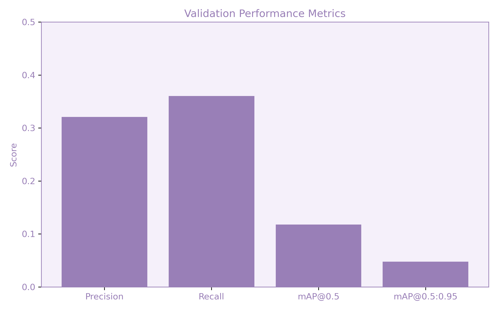
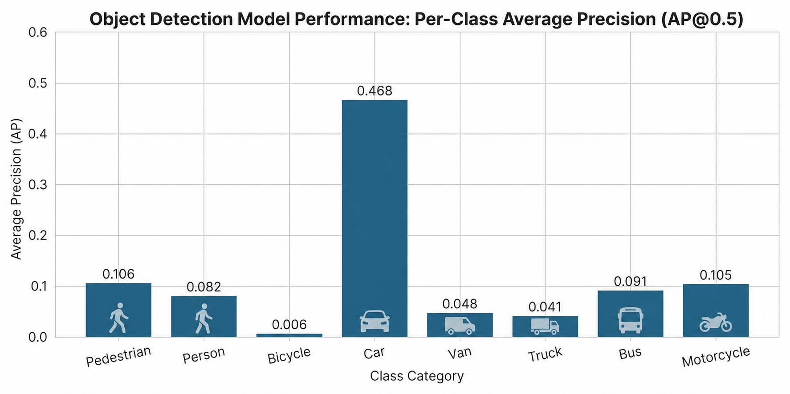
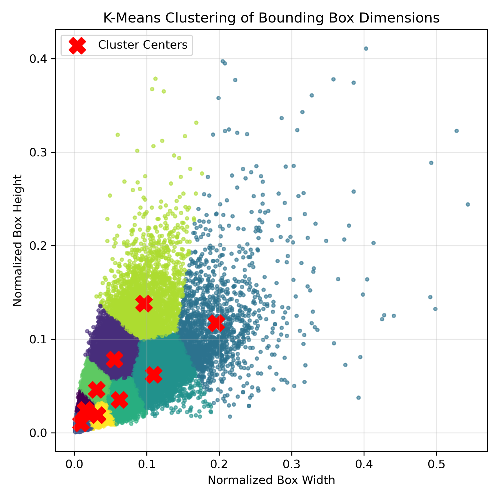
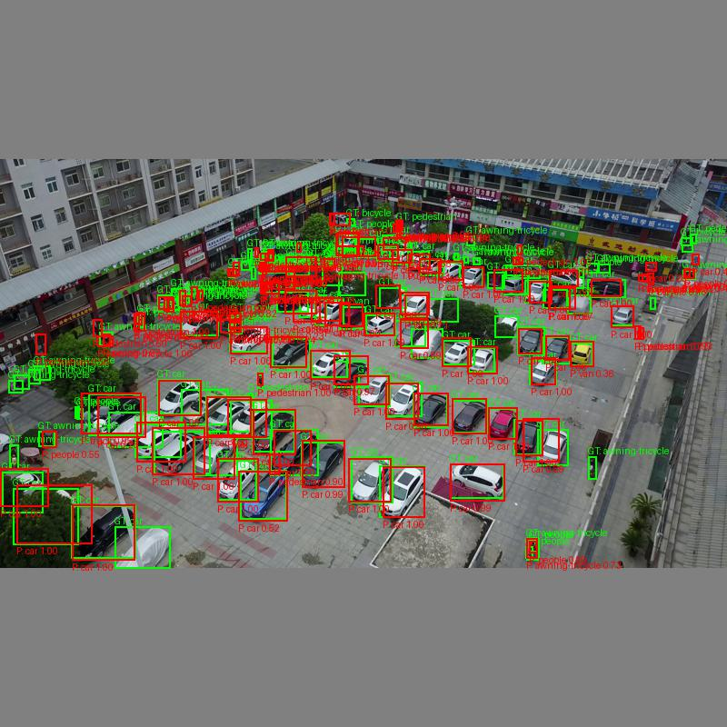
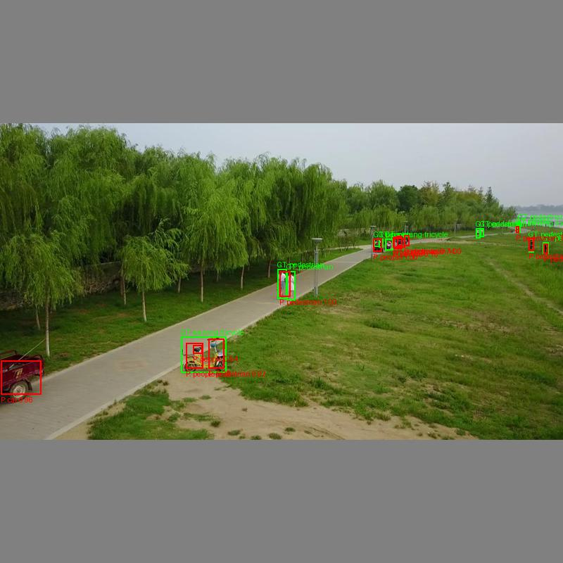

# Real-Time UAV Object Detection from Live UAV Video (YOLOv3)

## Overview
This project implements a real-time object detection system using a YOLOv3-based model to identify pedestrians, bicycles, and vehicles from UAV (drone) video.

The goal was to evaluate whether a detection system could accurately identify traffic-related objects from aerial imagery while maintaining real-time performance suitable for deployment.

---

## Problem
Object detection from aerial imagery presents several challenges:

- Objects are extremely small (often only a few pixels)
- Scenes are densely populated
- Motion blur from drone movement
- Varying lighting and backgrounds

These factors make both classification and localization significantly more difficult compared to traditional ground-level detection.

---

## Approach

### Model
- YOLOv3 (Darknet-53 backbone)
- Multi-scale detection heads for small, medium, and large objects
- Anchor boxes optimized using clustering

### Dataset
- VisDrone UAV dataset
- Filtered to include traffic-related classes (pedestrians, bicycles, vehicles)

### Training
- Mixed precision training for efficiency
- Gradient accumulation for larger effective batch size
- Data augmentation applied to improve generalization
- Training performed on Clemson’s Palmetto cluster

### Preprocessing
- Letterbox resizing to maintain aspect ratio
- Bounding box normalization

---

## Real-Time Pipeline
The system processes live UAV video in real time:

1. Drone streams video via RTMP (Docker-hosted server)
2. Ground station receives stream
3. Frames are extracted using OpenCV
4. YOLOv3 performs detection (single forward pass)
5. Predictions filtered (confidence > 0.35)
6. Non-Maximum Suppression applied
7. Bounding boxes rendered with class labels

---

## Results

### Performance Metrics
- Precision: 0.32
- Recall: 0.36
- mAP@0.5: 0.12
- mAP@0.5:0.95: 0.05

These results show the model can detect objects but has difficulty with precise localization, especially under stricter evaluation thresholds.

---

## Key Insights

- Strong performance on larger objects (e.g., cars)
- Reduced accuracy on small objects (pedestrians, bicycles)
- Localization errors increase in dense scenes
- Some misclassification occurs with similar-looking objects

---

## Visual Results

### Detection Performance

### Per-Class Performance

### Anchor Box Clustering

---

## Validation Examples

Example predictions on validation images (green = ground truth, red = predictions):

These examples show:
- Accurate detection of larger vehicles
- Performance drops in crowded scenes
- Difficulty detecting small or partially occluded objects

---

## Real-Time Output

The system achieves approximately **15 FPS**, enabling smooth real-time detection.

- Strong performance in less crowded scenes
- Lower confidence on smaller objects
- Occasional bounding box misalignment

---

## Challenges

- Detecting small objects in aerial imagery
- Handling dense object overlap
- Balancing real-time performance with accuracy
- Hyperparameter tuning (multiple retraining cycles required)

---

## Future Improvements

- Increase input resolution for better small-object detection
- Apply tiling for high-density scenes
- Tune anchor boxes specifically for UAV imagery
- Explore newer YOLO architectures (YOLOv5/YOLOv8)
- Add object tracking for temporal consistency

---

## Tech Stack

- Python
- PyTorch / Darknet
- OpenCV
- Docker (RTMP streaming)
- YOLOv3

---

## Author
Zachary Elias  
Clemson University  
Computer Science / CIS  

---

## Notes

- Dataset is not included due to size constraints
- Sample outputs are provided for qualitative evaluation
